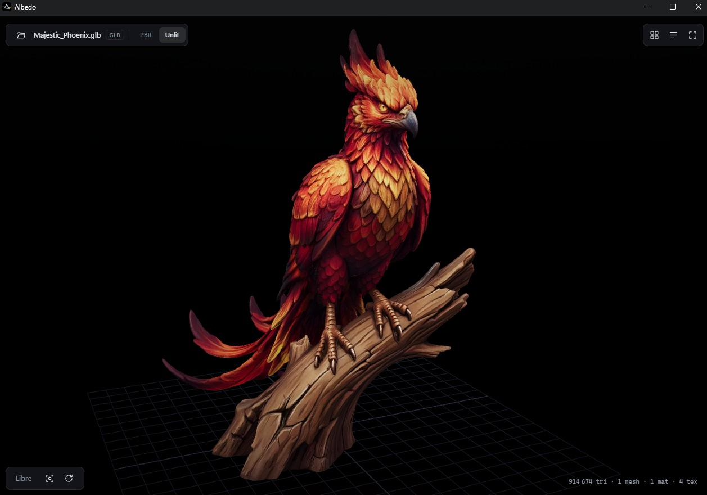
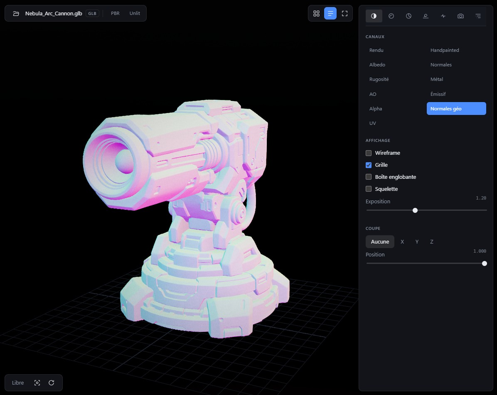
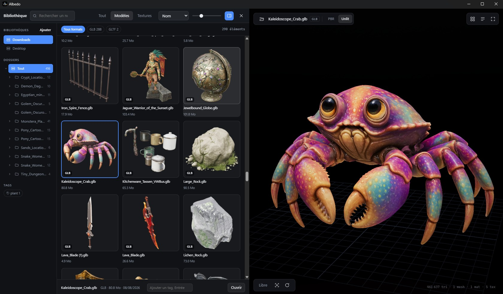
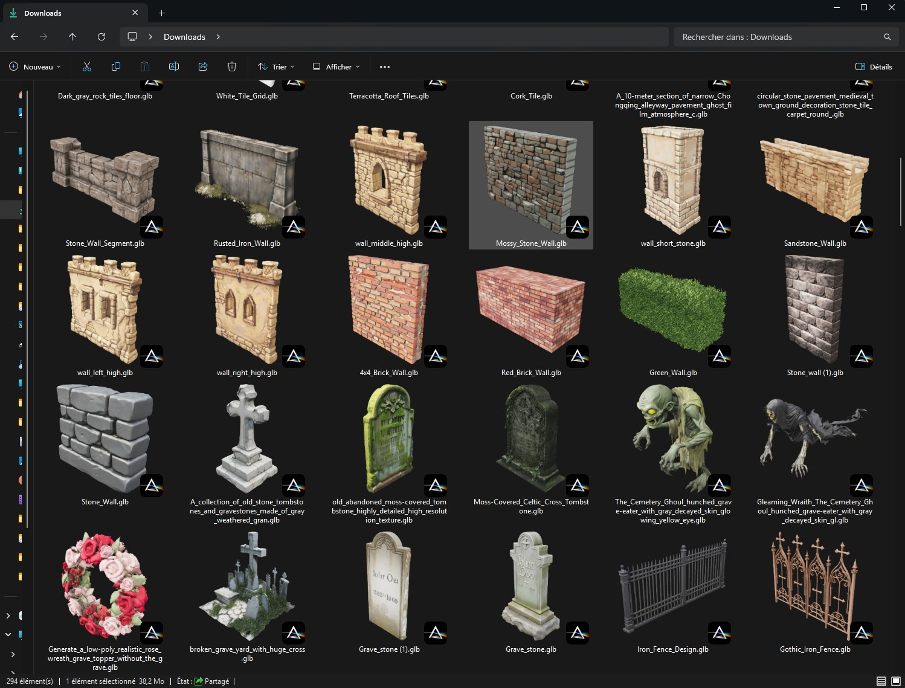

<p align="center">
  
</p>

# Albedo

A local 3D asset viewer for Windows. Open a model, look at it properly, and inspect what it is actually made of. No account, no upload, no network round trip.

Built with three.js inside a Tauri shell. The entire application is a 3.7 MB executable and a 1.5 MB installer.

<br>

<p align="center">
  
  <br>
  <sub><strong>3D Viewport Interface:</strong> Full-frame 3D rendering with floating translucent overlays, 11 unlit inspection channels, material contradiction flags, and 6-DOF camera control.</sub>
</p>

> [!NOTE]
> For demonstration and neutrality purposes, the 3D models featured in the screenshots throughout this README were generated using 3D AI.

---

## Key Features

- **Instant Startup**: Launches in under a second with lazy-loaded format modules and deferred lighting passes.
- **Broad Format Support**: Reads standard 3D formats (GLB, glTF, FBX, OBJ, STL, PLY, DAE, 3MF, 3DS, VRML, VOX, AMF, PCD/XYZ) as well as complex legacy and binary formats:
  - **NIF (NetImmerse / Gamebryo)**: Custom reader tested bit-exact across 10,001 Dark Age of Camelot files.
  - **USD (Binary `PXR-USDC` & `.usdz`)**: Native binary crate decoder with LZ4 decompression and float array decoding.
- **Inspection Tools**: 11 unlit inspection channels (Albedo, Normals, Roughness, Metalness, AO, Emissive, Alpha, etc.) plus PBR/Unlit toggles and material contradiction detection.
- **Windows Explorer Thumbnails**: Native `IThumbnailProvider` COM extension generating high-resolution Windows Explorer thumbnails for **all supported 3D formats** (GLB, glTF, FBX, OBJ, STL, NIF, USD, PLY, DAE, 3DS, VOX, etc.) via background WebGL rendering.
- **Forced File Association & Registry Integration**: Easily register or force 3D file associations and thumbnail shell handlers in the Windows Registry (`HKCU`) with a single click from the application settings panel.
- **Asset Manager**: Local asset library with sidecar tagging (`.albedo/library.json`), search, filtering, and a non-leaking preview strip.
- **Multi-Device Navigation**: Orbit and Fly camera modes, full Xbox controller mapping, and 6-DOF 3Dconnexion SpaceMouse support via WebHID.
- **Interactive Edit Mode**: Position, rotation, and scale gizmo handles with numerical fine-tuning and full undo/redo.

---

## Rendering & Post-Processing Pipeline

Albedo features a physically based rendering engine coupled with a studio-grade post-processing pipeline designed to deliver cinematic visual quality matching tools like Marmoset Toolbag and Sketchfab.

### Render Inspector Controls

<p align="center">
  
  <br>
  <sub><strong>Render & Post-Processing Inspector:</strong> Real-time controls for custom light rigs, exposure, tone mapping, GTAO ambient occlusion, optical bloom, depth of field, color grading, sharpening, and SMAA antialiasing.</sub>
</p>

- **Linear Optical Passes** (evaluated in linear light before tone mapping):
  - **GTAO (Ground Truth Ambient Occlusion)**: High-precision contact shading providing realistic depth and spatial grounding.
  - **Bloom**: Adjustable threshold, strength, and radius for natural light spill on bright and emissive surfaces.
  - **Depth of Field**: Subject-relative focal control expressed as a fraction of model depth for a consistent look at any scale.
- **Darkroom & Color Grading Passes** (evaluated on tone-mapped pixels):
  - **Color Grading**: Real-time contrast, saturation, and color temperature tuning.
  - **Unified Lens Pass**: Vignette, film grain, chromatic aberration, and sharpening combined in a single GPU pass for zero performance overhead.
  - **SMAA Antialiasing**: Crisp subpixel morphological antialiasing on final output.
- **Zero-Cost Idle & Tone Compensation**:
  - **On-Demand Rendering**: The frame loop pauses when the viewport is static, drawing 0% GPU/CPU.
  - **Clear Color Compensation**: Backdrop colors are tone-curve pre-compensated so background gradients remain identical whether post-processing is active or inactive.

---

## Interface Showcase

<p align="center">
  
  <br>
  <sub><strong>Asset Manager & Live Preview Strip:</strong> Dedicated asset browser featuring recursive folder trees, quick filter tags, multi-property sorting, and an interactive side-drawer preview strip that re-uses GPU memory cleanly.</sub>
</p>

<br>

<p align="center">
  
  <br>
  <sub><strong>Windows Explorer Integration:</strong> High-resolution 3D thumbnail previews generated directly inside Windows Explorer for all supported file formats via Albedo's native COM shell provider.</sub>
</p>

---

## High-Fidelity Render Showcase

<p align="center">
  
  <br>
  <sub><strong>High-Detail Asset Render:</strong> Detailed PBR surface rendering with active GTAO, realistic depth of field, and micro-surface roughness fidelity.</sub>
</p>

<br>

<p align="center">
  
  <br>
  <sub><strong>Cinematic Studio Lighting:</strong> High-resolution viewport render demonstrating multi-light dome positioning, exposure tuning, and SMAA antialiasing.</sub>
</p>

---

## Quick Reference & Documentation

Detailed technical documentation and reference guides are organized in the [`docs/`](docs/) directory:

- [**Supported Formats & Decoders**](docs/FORMATS.md): Full format compatibility status matrix, NIF block size benchmarks, and USD crate parsing notes.
- [**Navigation & Controls Guide**](docs/CONTROLS.md): Keyboard shortcuts, Xbox gamepad controls, SpaceMouse WebHID 6-DOF mapping, and Edit Mode handles.
- [**Architecture & System Design**](docs/ARCHITECTURE.md): Startup optimization metrics, memory disposal & leak prevention, material contradiction rules, shell thumbnail COM DLL architecture, and post-processing pipeline.
- [**Feature Verification & Roadmap**](docs/ROADMAP.md): Comprehensive feature verification checklist, test evidence log, and upcoming milestones.

---

## Building from Source

```bash
npm install
npm run dev          # Frontend only, running in browser
npm run tauri dev    # Full application inside Tauri shell
npm run tauri build  # Production release build and NSIS installer
```

For thumbnail provider development, register via the helper script:
```powershell
tools\install-thumbnail-provider.ps1
```

---

## Project Structure

```
src/
  main.js              Application wiring
  prefs.js             Roaming settings persistence
  ui/controls.js       Overlays, inspector, timeline
  library/
    index.js           Asset manager (lazy loaded)
    thumbs.js          Thumbnail cache interface
    library.css        Asset manager styles
  viewer/
    viewer.js          Viewport host & on-demand renderer
    loaders.js         Format dispatch
    channels.js        Inspection channels
    materials.js       PBR normalisation
    textures.js        Texture discovery
    navigation.js      Orbit, fly, gamepad, SpaceMouse
    post.js            Post-processing pipeline (GTAO, Bloom, DoF, SMAA)
    release.js         Memory disposal & GPU resource release
    specgloss.js       KHR_materials_pbrSpecularGlossiness handler
    usd.js             USD package loader
    usdc/              Binary USDC crate reader
    nif/               NetImmerse / Gamebryo NIF reader
src-tauri/             Rust shell, file association, texture search
shell-thumbnails/      IThumbnailProvider COM DLL, cache, registration
tools/
  make-samples.mjs     Sample generator per supported format
```
